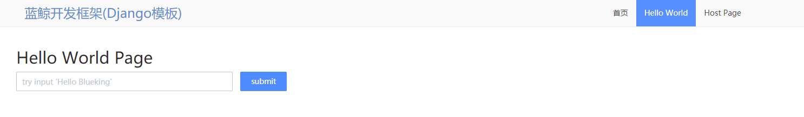
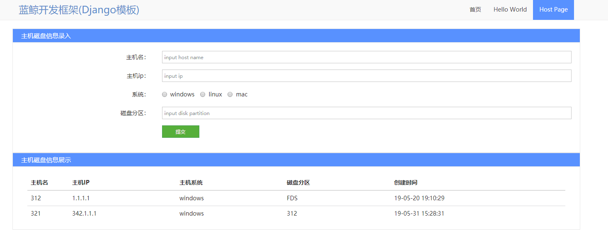

## 【早起鸟儿活动】作业2和作业3完整代码

这个是本人根据官方的视频资料学习所完成的作业，主要设计基础的saas应用开发和前后端交互，数据库的插入和查询等，从作业来讲相对基础，适合大家入门和熟悉蓝鲸开发框架。

#### 代码使用说明
代码中涉及配置的部分需要自行配置：
- config\\\_\_init\_\_.py 中的APP_CODE和SECRET_KEY
- config\\dev.py中的数据库配置

配置完这两项，基本就可以在本地顺利把项目跑起来，如果需要部署上线，再配置prod.py和stag.py。

#### 运行环境和步骤
1. 在python3环境下运行此代码
2. 安装依赖所需的包(如果出现问题，在uwsgi前加'#'注释掉)：
```
pip install -r requirements.txt
```
3. 进行数据库相关初始化：
```
python manage.py migrate
```
4. 配置hosts映射：
在本地host表中配置相关host映射，具体可看官网新手教程，我本地配置的是
127.0.0.1 dev.paas.class.o.qcloud.com
5. 运行项目：
```
python manage.py runserver
```
6. 访问网页：
http://dev.paas.class.o.qcloud.com:8000

#### 运行效果
作业2

作业3



----

以下是官方框架文档说明：

蓝鲸智云应用开发模板--助力你的自动化
这里有各种层次的应用样例，根据你的需要，选择合适的样例开始快速开发。

- 运行要求说明：

```
安装requirements.txt文件中的python包
安装mysql，并调整 config\dev.py里的DB用户名和密码
数据库初始化： 本模版工程的具体使用过程如下：
                      1. manage.py migate    (初始化数据库表)
                      2. 针对有表的application创建表：
                      例如：manage.py migrate home_application

在项目文件夹同级的目录里建立logs文件夹（如不清楚可以直接runserver后看错误提示信息）
```
 
目录说明：


- 公共包
	- blueapps：蓝鲸开发框架公共模块
	- blueking：蓝鲸应用网关模块
	- static：态文件(css, js, img)
	- templates：模版（django模版和mako模版，如果说ajax的子页面，模版文件可以使用其他后缀，如**.part）

- 配置包
    - config：用户配置包
    	- dev.py：开发环境配置，如 数据库
    	- stag.py： 测试环境配置
    	- prod.py：正式环境配置

- 应用包
	- home_application: 你的根应用包，用于开发你的应用的主要功能，子功能可以单独建立其他的应用包


#### 开发说明：

- 修改配置文件
	- conf/\_\_init__.py 文件：APP_ID \ APP_TOKEN （蓝鲸智云开发者中心 -> 点击应用ID -> 基本信息 中可以查看到这个两个值的信息）
	- conf/\_\_init__.py.py 文件：BK_PAAS_HOST（蓝鲸智云开发者中心的域名，形如：http://paas.bking.com）
	- conf/dev.py 文件：DATABASES（本地开发数据库信息）
	- conf/stag.py 文件：DATABASES（测试环境数据库信息）
	- conf/prod.py 文件：DATABASES（正式环境数据库信息）
